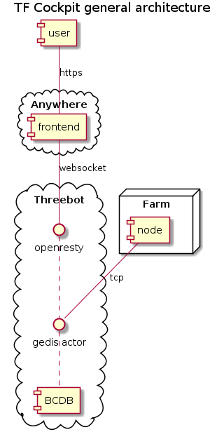

# TF Cockpit general architecture

The TF Cockpit is meant to the be entry point for the TF Grid. It present all the information needed for grid users, farmers or token holders.

The cockpit frontend is a simple web application that will get its data from a [BCDB](https://github.com/threefoldtech/digitalmeX/tree/development/docs/BCDB) instance.

The BCDB is itself populated by different data producers (3Nodes, TFChain, users).

BCDB being a library, it needs to have network interfaces to be reachable by data producers. The main interface is a [Gedis](https://github.com/threefoldtech/digitalmeX/tree/development/docs/Gedis) actor.

Gedis works on top of plain tcp socket, which means it is not reachable by the frontend directly. Instead, the [Threebot](https://github.com/threefoldtech/digitalmeX/tree/development/docs/3Bot) framework allow to reach a gedis actor over websocket using a javascript client provided by the Threebot hosting the BCDB instance.
